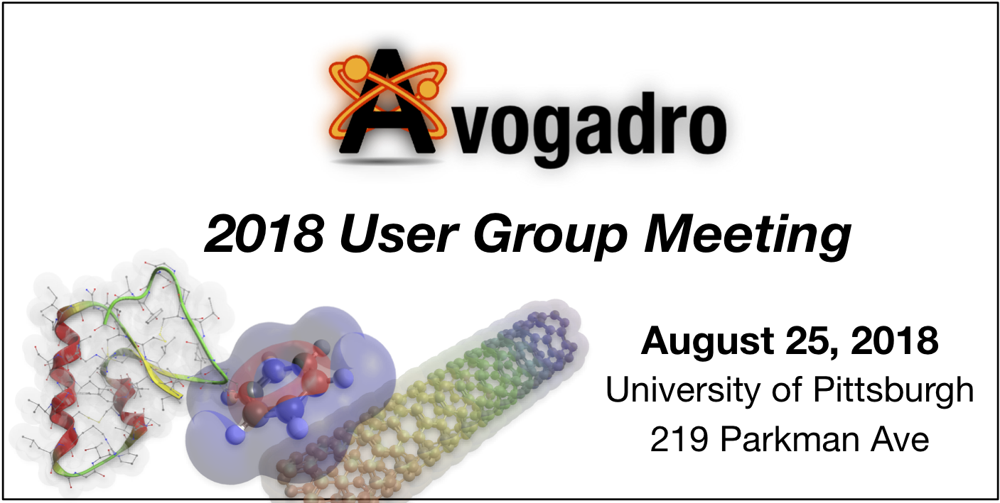

# Avogadro 2018 Users Group Meeting

## Schedule

|Time|	Speaker|	Topic|
|:-------:|:-------|:-------|
|9:00-9:30|Geoffrey Hutchison, Pitt|	[Welcome, Intro & Community Feedback](https://github.com/OpenChemistry/avogadro-ugm2018/blob/master/talks/Hutchison-Overview.pdf)|
|9:30-10:00|	Marcus Hanwell, Kitware|	[Avogadro 2, Open Chemistry](https://github.com/OpenChemistry/avogadro-ugm2018/blob/master/talks/Avogadro2-OpenChemistry.pdf) |
||Break		
|10:20-10:40|	Patrick Avery, U. Buffalo|	Extended Hückel, Solids and Avogadro|
|10:40-11:00|	John Keith, Pitt|	[Quantum chemistry modeling of
 local solvation effects](https://github.com/OpenChemistry/avogadro-ugm2018/blob/master/talks/Keith-SolvationEchem.pdf)|
||Coffee Break		
|11:15-11:35|	Chris Wilmer, Pitt|	Contributed Talk (TBA)|
|11:35-11:55|	Gaurav Chopra, Purdue|	CANDIY & GUI-CANDIY|
|12:00-12:30|	10-minute Lightning Talks
|12:00-12:10| Talk 1  |
|12:10-12:20| Talk 2 |
|12:20-12:30| Talk 3  |
|12:30-2:00|	Lunch (On Your Own)	|
|2:00-3:00|	Roundtable Discussion (Avogadro 2 Roadmap)	|
|3:00-6:00|	Hackathon & Tutorials	|
